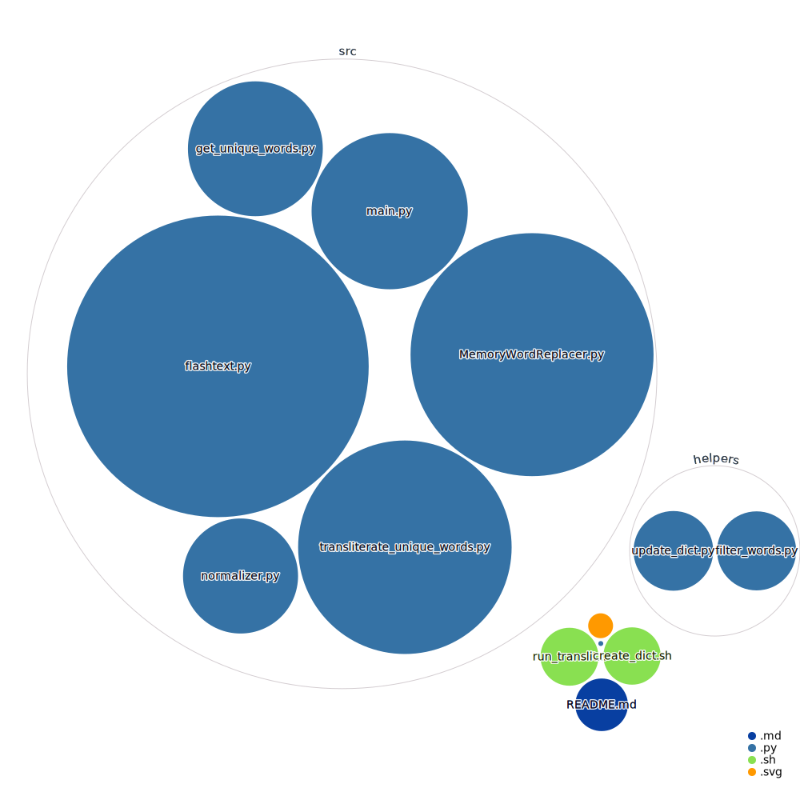

# Setu-Transliterate: A Large Scale Transliteration Pipeline

Setu-Transliterate uses [IndicXlit](https://github.com/AI4Bharat/IndicXlit) for performing large-scale transliteration across English and 22 Indic Languages.

[View interactive Diagram](https://octo-repo-visualization.vercel.app/?repo=integerman%2FVisualizingCode)
